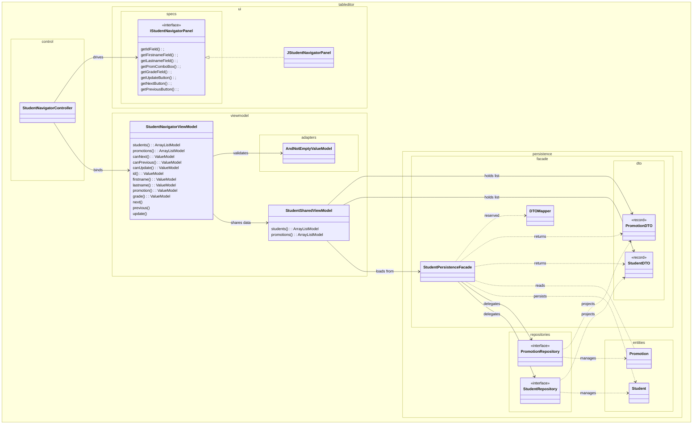

# Swing Table Editor

A test for a simple Swing editor for a database table.

In this branch, we use exclusively the JGoodies framework.

It requires us :

- To provide a `Model` of the application ;
- this model will communicate with the DomainModel.


To run the test, first start the docker container with the command:

```
docker-compose up
```

Then run the app with 

~~~
./gradlew bootRun
~~~

## Architecture and Swing libraries

The app displays an editable table of students, which can be filtered. It also displays the average grade of all students, which is updated by MVC.

We use only JGoodies in this example. A pity that you can't find documentation on the web, save on wayback machine.


### Relevant design decisions

- all views use the **[Passive View](https://martinfowler.com/eaaDev/PassiveScreen.html)** pattern; basically, they are widgets without behaviour; with getters to access their components;
- to simplify the use of the views, and hide all `JComponent` related methods which are irrelevant, we have provided interfaces (e.g. `IStudentNavigatorPanel` for `JStudentNavigatorPanel`), which publish only the getters for the subcomponents.

## Schema

The system provides three different views:

- `JStudentTable`, which displays the list of students, and allows to delete them;
- `JStudentCreatorPanel`, which allows to create new students;
- `JStudentNavigatorPanel`, which allows to navigate between students, and edit them.

They are grouped in the `JStudentBase` class, which is the main window of the application.

Each of them has its own `ViewModel` and `Controller`.

To give an idea of the architecture, without going into too much detail, here is a partial schema, focusing on the `StudentNavigator` part.





## Note

To generate UML diagrams for the project, you can simply run:

~~~bash
./gradlew javadoc
~~~

