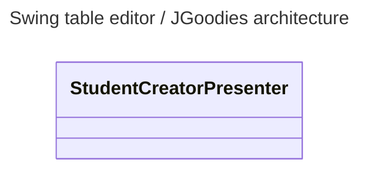

# Swing Table Editor

A test for a simple Swing editor for a database table.

In this branch, we use exclusively the JGoodies framework.

It requires us :

- To provide a `Model` of the application ;
- this model will communicate with the DomainModel.


To run the test, first start the docker container with the command:

```
docker-compose up
```

Then run the app with 

~~~
./gradlew bootRun
~~~

## Architecture and Swing libraries

The app displays an editable table of students, which can be filtered. It also displays the average grade of all students, which is updated by MVC.

We use only JGoodies in this example. A pity that you can't find documentation on the web, save on wayback machine.

## Schema



- **TODO** : rename the Presenter classes.
- **TODO** : follow the same architecture as the SwingFX version.